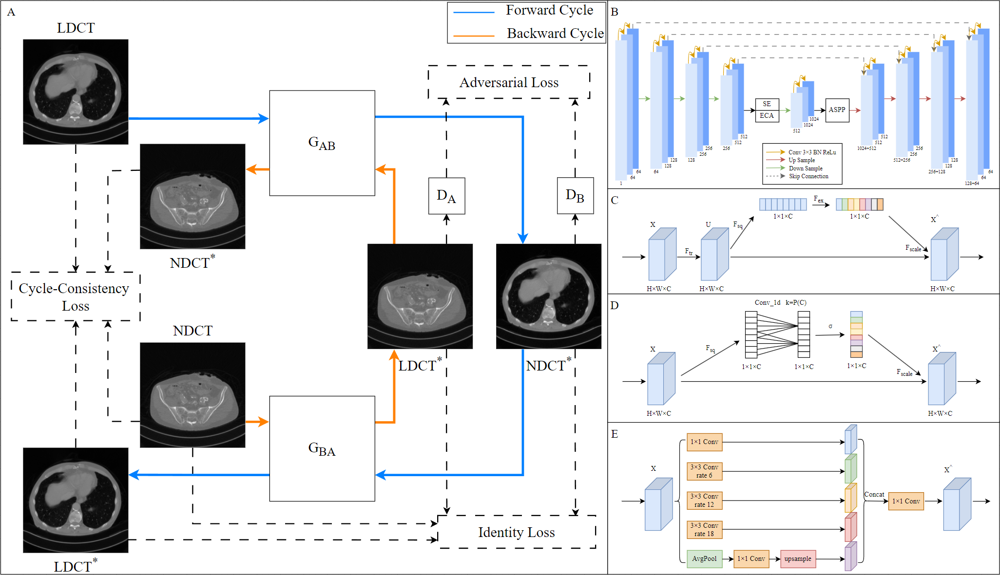

## Denoising LDCT Images Based on CycleGAN

  

A framework for LDCT image denoising without paired data, apply CycleGAN to achieve mutual conversion between noisy and noiseless image domains. The generator adopts a UNet architecture, incorporating channel attention mechanisms and spatial pyramid pooling to generate high-quality noiseless images. A PatchGAN discriminator is used, and a perceptual loss mixed loss function is applied during training.